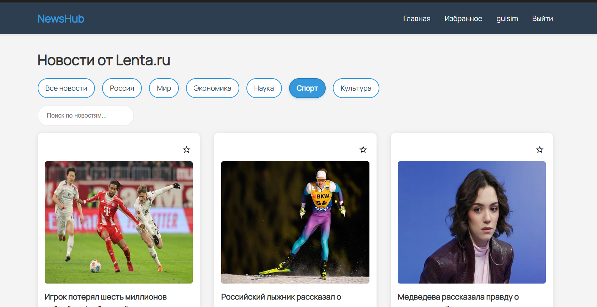
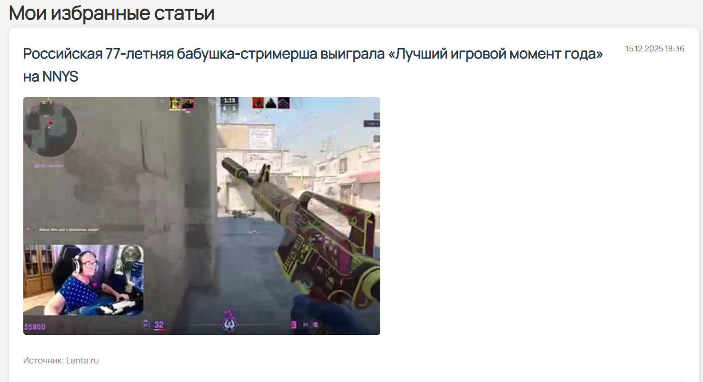
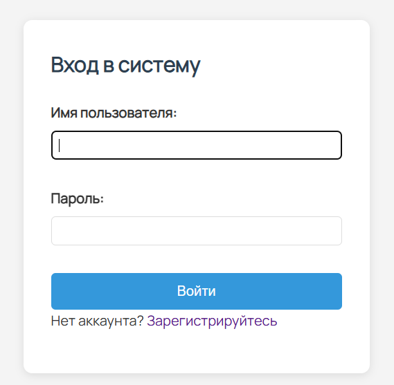
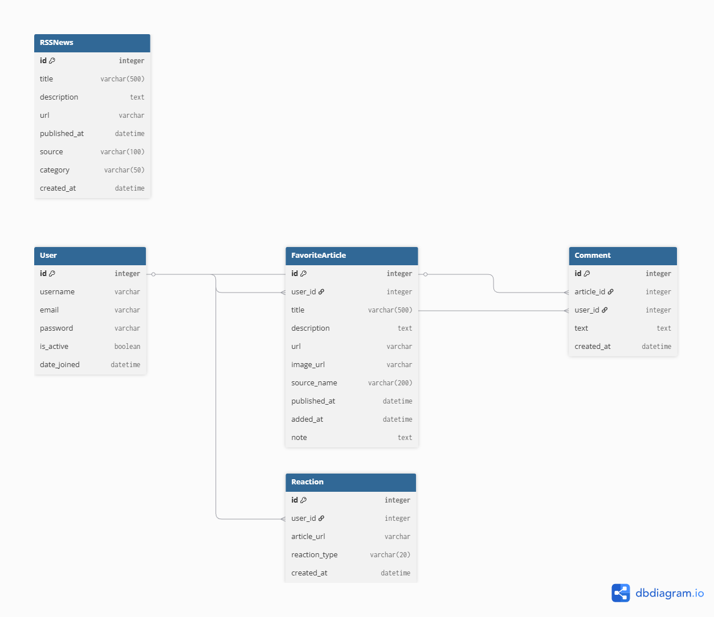
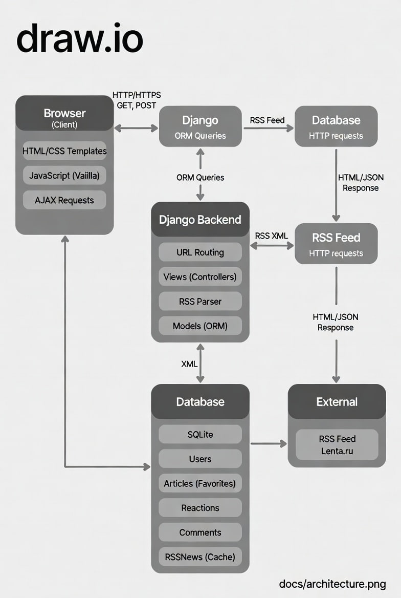

# NewsHub — Агрегатор новостей

**NewsHub** — это современное веб-приложение для агрегации и управления новостями из RSS-лент. Пользователи могут просматривать новости по категориям, сохранять интересные статьи в избранное, оставлять комментарии и выражать эмоциональные реакции на новости.

Приложение получает новости из RSS-ленты Lenta.ru, предоставляя удобный интерфейс для их просмотра и управления. Реализована система пользователей с возможностью регистрации и авторизации, что позволяет каждому пользователю иметь персональное избранное и комментарии.

## Features

- 📰 **Лента новостей по категориям** — просмотр новостей из различных категорий (Россия, Мир, Экономика, Наука, Спорт, Культура)
- 🔍 **Поиск по ключевым словам** — быстрый поиск новостей по заголовку и описанию
- 👤 **Регистрация и авторизация** — система пользователей с безопасной аутентификацией
- ⭐ **Сохранение в избранное** — добавление интересных статей в персональное избранное
- 💬 **Комментирование избранного** — возможность добавлять, редактировать и удалять комментарии к сохраненным статьям
- 😊 **Быстрые эмоциональные реакции** — 5 типов реакций на новости (🔥 важно, 🤔 интересно, 😱 шокирует, 💡 полезно, ❤️ нравится) с подсчетом количества
- 📊 **Административная панель** — управление данными через Django Admin
- 💾 **Кеширование новостей** — автоматическое сохранение новостей в БД для быстрого доступа

## Tech Stack

### Backend
- **Python 3.14** — язык программирования
- **Django 5.2.8** — веб-фреймворк
- **SQLite** — база данных (для разработки)

### Libraries
- **feedparser 6.0.12** — парсинг RSS-лент
- **python-decouple 3.8** — управление переменными окружения

### Frontend
- **HTML5/CSS3** — разметка и стилизация
- **JavaScript (Vanilla)** — интерактивность и AJAX-запросы
- **Django Templates** — шаблонизация

### Tools
- **Django Admin** — административная панель
- **SQLite** — база данных

## Installation

### Предварительные требования

- Python 3.8 или выше
- pip (менеджер пакетов Python)
- Git (для клонирования репозитория)

### Пошаговая установка

1. **Клонируйте репозиторий:**
   ```bash
   git clone <repository-url>
   cd newshub
   ```

2. **Создайте виртуальное окружение:**
   ```bash
   # Windows
   python -m venv venv
   venv\Scripts\activate
   
   # Linux/Mac
   python3 -m venv venv
   source venv/bin/activate
   ```

3. **Установите зависимости:**
   ```bash
   pip install -r requirements.txt
   ```

4. **Примените миграции:**
   ```bash
   python manage.py migrate
   ```

5. **Создайте суперпользователя (опционально, для доступа к админ-панели):**
   ```bash
   python manage.py createsuperuser
   ```
   Следуйте инструкциям для ввода имени пользователя, email и пароля.

6. **Запустите сервер разработки:**
   ```bash
   python manage.py runserver
   ```

7. **Откройте браузер и перейдите по адресу:**
   ```
   http://127.0.0.1:8000/
   ```

### Доступ к админ-панели

После создания суперпользователя, административная панель доступна по адресу:
```
http://127.0.0.1:8000/admin/
```

## Screenshots

### Главная страница с новостями

*Лента новостей с категориями, поиском и реакциями*

### Страница избранного

*Персональное избранное с комментариями*

### Страница регистрации

*Форма регистрации нового пользователя*

### Страница входа

*Форма авторизации*

## Database Schema (ER-диаграмма)



### Описание моделей

- **User** (Django встроенная модель) — пользователи системы
- **RSSNews** — кешированные новости из RSS-ленты
- **FavoriteArticle** — избранные статьи пользователей
- **Comment** — комментарии к избранным статьям
- **Reaction** — эмоциональные реакции на новости

Подробная ER-диаграмма доступна в файле [docs/diagrams.png](docs/diagrams.png).

## API Endpoints

Приложение предоставляет REST API для взаимодействия с фронтендом через AJAX-запросы. API используется для динамического обновления интерфейса без перезагрузки страницы.

**Base URL:** `http://127.0.0.1:8000`

### Аутентификация

Все API endpoints (кроме публичных страниц) требуют аутентификации пользователя через Django сессии. Для AJAX-запросов необходимо включить CSRF токен в заголовках:

```
X-CSRFToken: <csrf_token>
```

CSRF токен можно получить из cookie `csrftoken` или из формы на странице.

### Список эндпоинтов

1. **POST /api/toggle-favorite/** - Добавить/удалить статью из избранного
2. **POST /api/add-reaction/** - Добавить/изменить/удалить реакцию на новость
3. **POST /api/add-comment/** - Добавить комментарий к избранной статье
4. **POST /api/edit-comment/<comment_id>/** - Редактировать комментарий
5. **POST /api/delete-comment/<comment_id>/** - Удалить комментарий

Подробная документация API доступна в файле [docs/API.md](docs/API.md).

### Детальное описание эндпоинтов

### Endpoints

#### 1. Добавить/удалить из избранного
- **URL:** `/api/toggle-favorite/`
- **Method:** `POST`
- **Auth:** Требуется
- **Request Body:**
  ```json
  {
    "url": "https://lenta.ru/news/...",
    "title": "Заголовок новости",
    "description": "Описание новости",
    "urlToImage": "https://...",
    "source": {"name": "Lenta.ru"},
    "publishedAt": "2025-01-15T10:00:00Z"
  }
  ```
- **Response:**
  ```json
  {
    "success": true,
    "is_favorite": true
  }
  ```

#### 2. Добавить/изменить реакцию
- **URL:** `/api/add-reaction/`
- **Method:** `POST`
- **Auth:** Требуется
- **Request Body:**
  ```json
  {
    "url": "https://lenta.ru/news/...",
    "reaction_type": "important"
  }
  ```
- **Response:**
  ```json
  {
    "success": true,
    "reaction_type": "important",
    "reactions_count": {
      "important": 5,
      "interesting": 3
    }
  }
  ```
- **Reaction Types:** `important`, `interesting`, `shocking`, `useful`, `liked`

#### 3. Добавить комментарий
- **URL:** `/api/add-comment/`
- **Method:** `POST`
- **Auth:** Требуется
- **Request Body:**
  ```json
  {
    "article_id": 1,
    "text": "Текст комментария"
  }
  ```
- **Response:**
  ```json
  {
    "success": true,
    "comment": {
      "id": 1,
      "text": "Текст комментария",
      "created_at": "15.01.2025 10:00"
    }
  }
  ```

#### 4. Редактировать комментарий
- **URL:** `/api/edit-comment/<comment_id>/`
- **Method:** `POST`
- **Auth:** Требуется
- **Request Body:**
  ```json
  {
    "text": "Обновленный текст комментария"
  }
  ```
- **Response:**
  ```json
  {
    "success": true,
    "comment": {
      "id": 1,
      "text": "Обновленный текст комментария",
      "created_at": "15.01.2025 10:00"
    }
  }
  ```

#### 5. Удалить комментарий
- **URL:** `/api/delete-comment/<comment_id>/`
- **Method:** `POST`
- **Auth:** Требуется
- **Response:**
  ```json
  {
    "success": true
  }
  ```

## Architecture



### Компоненты системы

1. **Браузер (Client)**
   - Отображает интерфейс пользователя
   - Отправляет HTTP-запросы
   - Обрабатывает AJAX-запросы для динамического обновления

2. **Django Backend**
   - Обрабатывает HTTP-запросы
   - Управляет бизнес-логикой
   - Взаимодействует с БД
   - Генерирует HTML-шаблоны

3. **RSS Parser**
   - Получает новости из RSS-ленты Lenta.ru
   - Парсит XML-данные
   - Сохраняет в БД для кеширования

4. **Database (SQLite)**
   - Хранит пользователей
   - Хранит новости (кеш)
   - Хранит избранное, комментарии, реакции

5. **Django Admin**
   - Административная панель
   - Управление данными

### Поток данных

1. Пользователь открывает главную страницу
2. Django получает запрос и вызывает `home` view
3. View вызывает `fetch_rss_news()` для получения новостей
4. RSS Parser обращается к Lenta.ru RSS или использует кеш из БД
5. Данные возвращаются в шаблон и отображаются пользователю
6. При взаимодействии (избранное, реакции) отправляются AJAX-запросы
7. Backend обрабатывает запросы и обновляет БД
8. Ответ возвращается в JSON формате

Подробная архитектурная схема доступна в файле [docs/screenshots/architecture.jpg](docs/screenshots/architecture.jpg).

## Project Structure

```
newshub/
├── config/                 # Настройки Django проекта
│   ├── settings.py        # Конфигурация приложения
│   ├── urls.py            # Главные URL-маршруты
│   └── wsgi.py            # WSGI конфигурация
├── news/                   # Основное приложение
│   ├── models.py          # Модели данных
│   ├── views.py           # Представления (контроллеры)
│   ├── urls.py            # URL-маршруты приложения
│   ├── rss_parser.py      # Парсер RSS-лент
│   ├── admin.py           # Настройки админ-панели
│   ├── templates/         # HTML шаблоны
│   │   └── news/
│   │       ├── home.html
│   │       ├── favorites.html
│   │       ├── login.html
│   │       └── register.html
│   └── templatetags/      # Кастомные теги шаблонов
│       └── news_extras.py
├── static/                 # Статические файлы
│   ├── css/
│   │   └── style.css
│   ├── js/
│   │   └── script.js
│   └── images/
├── templates/              # Базовые шаблоны
│   └── base.html
├── docs/                   # Документация
│   ├── er-diagram.png
│   ├── architecture.png
│   └── screenshots/
├── manage.py               # Django management script
├── requirements.txt        # Зависимости проекта
└── README.md              # Этот файл
```

## Development

### Запуск в режиме разработки

```bash
python manage.py runserver
```

### Создание миграций

```bash
python manage.py makemigrations
```

### Применение миграций

```bash
python manage.py migrate
```

### Создание суперпользователя

```bash
python manage.py createsuperuser
```

### Обновление новостей для всех категорий

```python
from news.rss_parser import update_all_categories
update_all_categories()
```

## License

Этот проект создан в образовательных целях.

## Authors

Саралиева Гульсим, Рязанова Мария. sГруппа: К0709-23/3


